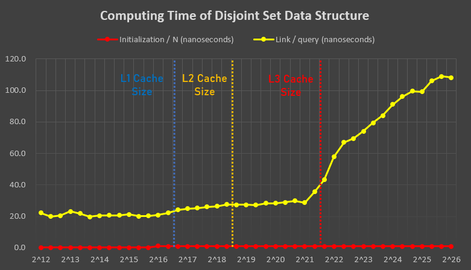

# Disjoint Set Libary

[Disjoint Set](https://en.wikipedia.org/wiki/Disjoint-set_data_structure) is a data structure which efficiently merges two groups and check if two elements are in the same group or not. We can also view this data structure in a graph theory way.

## What is Disjoint Set?

Initially, the element 0, 1, 2, ..., N-1 are in the different groups. After that, we will process any of the following three types of queries.  
* `link(x, y)` : Merge "group of element x" and "group of element y" if element x and y belongs to different groups.
* `connected(x, y)` : Check if "element x" and "element y" are in the same group, or not.
* `size(x)` : Find the number of elements in "group of element x".

## Graph Theory View

We can view this data structure in a graph theory way.  
Initially, we have a graph with N vertices (numbered 0, 1, 2, ..., N-1), but no edges between them.
* `link(x, y)` : We draw an undirected edge between "vertex x" and "vertex y".
* `connected(x, y)` : Check if there is a path from "vertex x" to "vertex y" and vice versa, or not.
* `size(x)`: Find the size of connected component that "vertex x" belongs.

## Algorithm and Time Complexity / Memory Usage

Let's begin the "main dish" of disjoint set data structure!

### Algorithm

We use the algorithm called ["Union-Find Tree"](https://en.wikipedia.org/wiki/Disjoint-set_data_structure).  
For merging, we choose the tree which has a larger size, and go to the top.

### Time Complexity

The time complexity for initialization and each operation, and the memory usage, is following.  
|  Operation Type   | Average Time | Worst-case Time |
| ----------------- | ------------ | --------------- |
|  Initialization   |     O(n)     |      O(n)       |
|   `link(x, y)`    |  O(log* n)   |    O(log* n)    |
| `connected(x, y)` |  O(log* n)   |    O(log* n)    |
|     `size(x)`     |  O(log* n)   |    O(log* n)    |

Here, log* n denotes the [iterated logarithm](https://en.wikipedia.org/wiki/Iterated_logarithm) of n.  

### Memory Usage

The memory usage is exactly 4N + const bytes.  

## Functions

There are basically two following constructors, and of course copy constructors:  
* `disjoint_set()` : Default constructor. Initialize to empty disjoint set.
* `disjoint_set(n)` : Initialize to disjoint set with size n. **Here, n must be less than or equal to 231**.

And, there are five main functions. The details are following:  
* `std::size_t size()` : Returns the size of the disjoint set itself
* `std::size_t size(elem)` : Returns the size of the group with "element elem".
* `std::size_t root(elem)` : Returns the index of root of component with "element elem" as Union-Find tree. In other word, it returns the ID of group with "element elem".
* `void link(elemx, elemy)` : Merges group with "element elemx" and "element elemy" if they are not in the same group.
* `bool connected(elemx, elemy)` : Returns if "element elemx" and "element elemy" are in the same group.

## Compatibility

It is compatible for C++11 or newer.  

## Computing Time

In my compiler of G++ 7.4.0, with 2.6GHz CPU, it ran roughly in the following time:  

  

Here, for initialization, the computing time per N was like following:  
* For N < 65536 (= 216), the initialization time was around 0.25 nanoseconds per N.
* For N > 65536 (= 216), the initialization time was around 1.00 nanoseconds per N.

Also, for the computing time for other functions:  
* For `connected(x, y)`, its computing time is as same as `link(x, y)`.
* For `root(x)`, its computing time is as half as `link(x, y)`.

## Verification

This library is verified on many competitive programming problems, such as following:  
* PAKEN Programming Camp 2019 Day 3 "PAKEN CUP 2019" Problem E : "Big Christmas Presents"
	* https://atcoder.jp/contests/pakencamp-2019-day3/submissions/9336106
	* Verified for "size(elem)" and "link(elemx, elemy)"
	* Verified in January 6th, 2020
* AOJ DSL 1-A : Disjoint Set: Union Find Tree
	* https://onlinejudge.u-aizu.ac.jp/recent_judges/DSL_1_A/judge/4093054/square1001/C++11
	* Verified for "link(elemx, elemy)" and "connected(elemx, elemy)"
    * Verified in January 6th, 2020